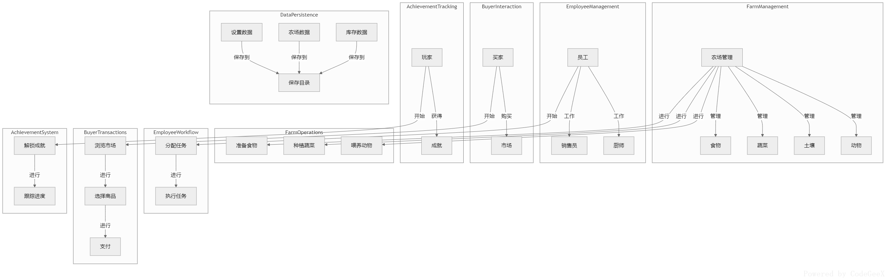
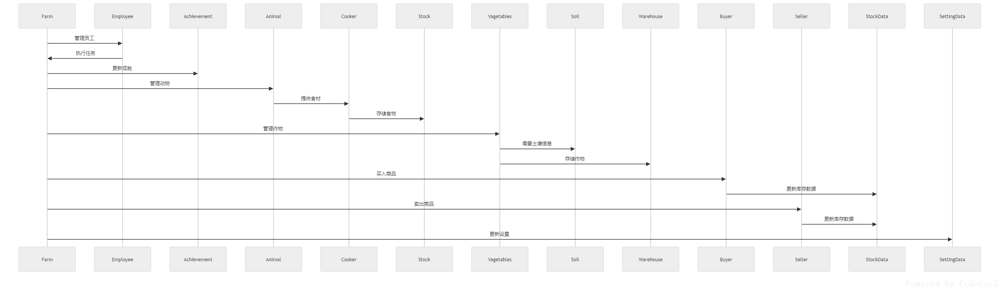
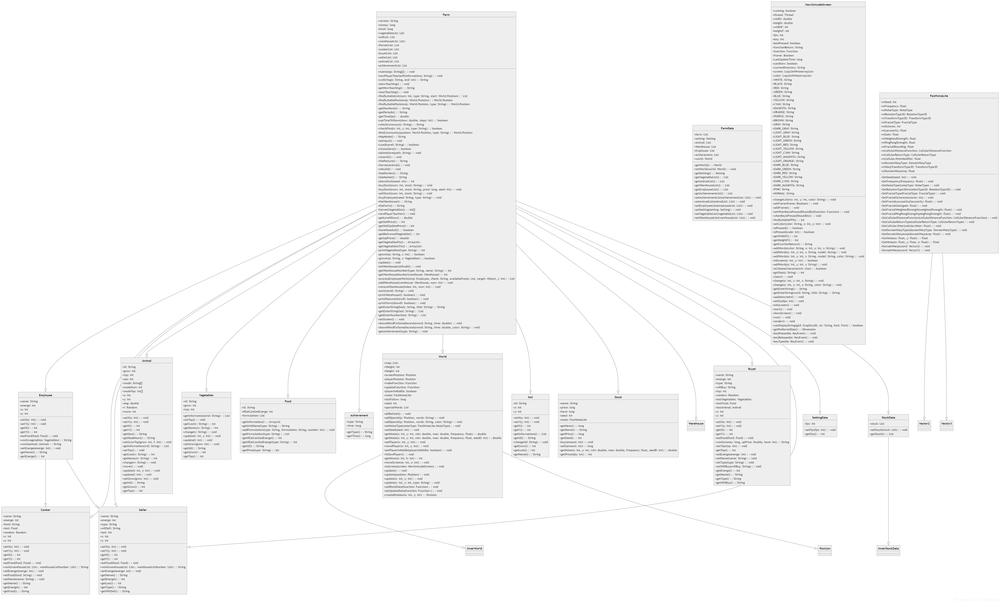

# **THE FARM IN WORD** 11.0 **UPDATE**
### 本次更新内容：
1. 添加了**股票系统**，玩家可以通过购买股票来获得收益。
2. 修复了部分bug。

---
---

# **THE FARM IN WORD**

<small>*MADE BY CHINAJEASON*</small>

**《THE FARM IN WORD》是一个综合性的农场管理系统，涵盖了从作物种植、动物养殖到员工管理、市场交易和成就系统的各个方面。通过这个系统，玩家可以全面管理农场，实现农场的自动化和高效运营。**

## 介绍
### Ⅰ. 玩法
**玩法说明：** 

玩家可以通过不同的操作来管理农场，包括种植作物、养殖动物、管理员工、进行市场交易和解锁成就。玩家需要通过新手教程来熟悉游戏的基本操作和流程，然后可以通过各种任务来提升农场的效率和玩家的成就。

#### 1. 新手教程
- **流程**：
  - 玩家可以选择是否进行新手教程。
  - 通过一系列的提示和引导，玩家将学习如何在世界模式中移动，如何进入仓库、农场和市场，以及如何购买种子、种植作物、收获作物和售卖作物。
  - 新手教程结束后，玩家将获得“新玩家”成就。

#### 2. 农场管理
- **目的**：管理农场中的动物、土壤、蔬菜和食物。
- **操作**：
  - 玩家可以通过 `Farm` 类来管理农场的各个方面。
  - 玩家可以种植蔬菜、养殖动物，并通过员工来执行这些任务。
  - 玩家还可以通过市场交易来买入商品和卖出商品。

#### 3. 员工管理
- **目的**：管理农场中的员工，如厨师、销售员等。
- **操作**：
  - 玩家可以通过 `Employee` 类来管理员工。
  - 员工可以执行分配的任务，如种植作物、养殖动物、制作食物和售卖商品。

#### 4. 市场交易
- **目的**：在市场中购买商品和售卖商品。
- **操作**：
  - 玩家可以通过 `Buyer` 和 `Seller` 类来进行市场交易。
  - 买家可以在市场中购买商品，卖家可以将商品卖给市场。

#### 5. 成就系统
- **目的**：通过完成特定任务来解锁成就。
- **操作**：
  - 玩家可以通过 `Achievement` 类来查看和管理成就。
  - 玩家可以通过完成特定任务来解锁成就，如第一次收获作物、第一次种植作物、第一次查看市场价格等。

#### 6. 数据保存
- **目的**：保存玩家的设置数据和农场的库存数据。
- **操作**：
  - 玩家可以通过 `SettingData` 和 `StockData` 类来保存和管理数据。
  - 所有数据都会保存到 `save` 目录中，包括 `setting.json` 和 `config.json` 文件。

#### 7. 用户界面
- **目的**：管理农场游戏的用户界面，显示信息和处理输入。
- **操作**：
  - 玩家可以通过 `NewUnicodeScreen` 类来查看和管理用户界面。
  - 用户界面会显示农场的各种信息和操作提示。

#### 8. 噪声生成
- **目的**：生成农场世界地图的噪声数据，用于地形生成。
- **操作**：
  - 玩家可以通过 `FastNoiseLite` 类来生成地形数据。

#### 9. 农场操作
- **目的**：进行农场的各种操作，如喂养动物、种植蔬菜、准备食物等。
- **操作**：
  - 玩家可以通过 `Farm` 类来进行各种农场操作。

#### 10. 员工工作流程
- **目的**：给员工分配任务并执行任务。
- **操作**：
  - 玩家可以通过 `Employee` 类来分配任务。
  - 员工会执行分配的任务。

#### 11. 买家交易流程
- **目的**：浏览市场中的商品，选择要购买的商品并进行支付。
- **操作**：
  - 玩家可以通过 `Buyer` 类来浏览市场中的商品。
  - 玩家可以选择要购买的商品并进行支付。

#### 12. 成就跟踪
- **目的**：跟踪玩家在解锁成就方面的进度。
- **操作**：
  - 玩家可以通过 `Achievement` 类来查看成就进度。
  - 玩家可以通过完成特定任务来解锁成就。

总的来说，这个项目的玩法涵盖了从新手教程、农场管理、员工管理、市场交易到成就跟踪和数据保存的各个方面。玩家可以在农场中管理动物、种植蔬菜、制作食物，并通过完成特定任务来解锁成就。同时，买家可以在市场中购买商品，员工可以执行分配的任务。所有数据都会保存到指定的目录中，确保数据的持久化。

### Ⅱ. 实现方式
**项目的实现方式：**

这个项目使用Java语言编写，通过面向对象的方式实现。主要类包括 `Farm`、`Animal`、`Vagetables`、`Employee`、`Cooker`、`Seller`、`Buyer`、`Achievement`、`World`、`Soil`、`Food`、`Stock`、`Warehouse`、`SettingData`、`StockData` 和 `NewUnicodeScreen` 等。

#### 1. 农场管理 (`Farm`)
- **用途**: 综合管理农场的所有资源和活动。
- **功能**:
  - 管理员工 (`Employee`)。
  - 更新成就 (`Achievement`)。
  - 管理动物 (`Animal`)。
  - 管理作物 (`Vagetables`)。
  - 买入商品 (`Buyer`)。
  - 卖出商品 (`Seller`)。
  - 更新设置 (`SettingData`)。

#### 2. 动物管理 (`Animal`)
- **用途**: 管理农场中的动物，包括生长、繁殖和移动。
- **功能**:
  - 动物移动 (`move()`)。
  - 动物生长 (`update()`)。
  - 动物繁殖逻辑 (`update()` 方法中包含动物繁殖逻辑)。

#### 3. 作物管理 (`Vagetables`)
- **用途**: 管理农场中的作物，包括种植、生长和收获。
- **功能**:
  - 作物生长 (`update()`)。
  - 作物收获 (`harvestVagetables()`)。

#### 4. 员工管理 (`Employee`)
- **用途**: 管理农场中的员工，包括农夫、厨师、买家和卖家。
- **功能**:
  - 员工工作 (`work()`)。
  - 员工吃食物 (`eatFood()`)。

#### 5. 仓库管理 (`Warehouse`)
- **用途**: 管理农场中的仓库，存储作物、食物和其他物品。
- **功能**:
  - 添加仓库物品 (`addWarehouse()`)。
  - 移除仓库物品 (`removeWarehouse()`)。

#### 6. 成就系统 (`Achievement`)
- **用途**: 记录和管理玩家的成就。
- **功能**:
  - 获取成就 (`getAchievement()`)。

#### 7. 世界地图 (`World`)
- **用途**: 管理农场的世界地图，包括地形、位置和特殊标记。
- **功能**:
  - 更新地图 (`update()`)。
  - 添加特殊标记 (`addSpecial()`)。

#### 8. 股票市场 (`Stock`)
- **用途**: 管理农场中的股票市场，允许玩家买卖股票。
- **功能**:
  - 买入股票 (`buyStock()`)。
  - 卖出股票 (`sellStock()`)。

#### 9. 设置管理 (`SettingData`)
- **用途**: 管理农场游戏的设置，如帧率等。
- **功能**:
  - 更新帧率 (`setFps()`)。

#### 10. 仓库数据 (`StockData`)
- **用途**: 管理农场中的仓库数据。
- **功能**:
  - 设置仓库数据 (`setStock()`)。

#### 11. 用户界面 (`NewUnicodeScreen`)
- **用途**: 管理农场游戏的用户界面，显示信息和处理输入。
- **功能**:
  - 显示屏幕 (`showScreen()`)。
  - 添加文字 (`addWords()`)。

#### 12. 噪声生成 (`FastNoiseLite`)
- **用途**: 生成农场世界地图的噪声数据，用于地形生成。
- **功能**:
  - 设置种子 (`SetSeed()`)。
  - 获取噪声 (`GetNoise()`)。

#### 13. 土壤管理 (`Soil`)
- **用途**: 管理农场中的土壤，包括土壤类型和生长情况。
- **功能**:
  - 更改土壤 (`change()`)。
  - 获取土壤信息 (`getInformations()`)。

#### 14. 食物管理 (`Food`)
- **用途**: 管理农场中的食物，包括食物配方和能量值。
- **功能**:
  - 添加配方 (`addFormulation()`)。
  - 获取配方 (`getFormulation()`)。

#### 15. 股票数据 (`InnerStockData`)
- **用途**: 管理农场中的股票数据。
- **功能**:
  - 设置股票数据 (`setStock()`)。

#### 16. 内部世界 (`InnerWorld`)
- **用途**: 表示农场世界地图中的单个区块。
- **功能**:
  - 设置自身 (`setSelf()`)。

#### 17. 位置 (`Posision`)
- **用途**: 表示农场世界地图中的位置。
- **功能**:
  - 创建位置 (`createPosision()`)。

#### 18. 向量 (`Vector2`, `Vector3`)
- **用途**: 用于噪声生成中的坐标计算。
- **功能**:
  - 域扭曲 (`DomainWarp()`)。

#### 19. 内部股票数据 (`InnerStockData`)
- **用途**: 表示农场中的单个股票数据。
- **功能**:
  - 获取股票数据 (`getStock()`)。

通过这些类和功能，这个项目提供了一个全面的农场管理系统，允许玩家管理农场中的各种资源和活动，实现农场运营的自动化和优化。

### Ⅲ. 各种量的计算方式
**各种量的计算方式：**

这个项目通过不同的类和方法来计算各种量，主要包括作物生长、动物繁殖、市场交易和成就解锁等方面。

#### 1. 作物生长
- **类和方法**：`Vagetables` 类的 `update()` 方法。
- **计算方式**：根据土壤质量和时间计算作物的生长。具体来说，作物的生长值会根据土壤的质量和时间逐渐增加，直到达到最大生长值。

#### 2. 动物繁殖
- **类和方法**：`Animal` 类的 `update()` 方法。
- **计算方式**：根据动物的成熟度和繁殖周期计算动物的繁殖。当动物的成熟度达到一定程度时，它们会进入繁殖状态，并可能产生新的动物。

#### 3. 市场交易
- **类和方法**：`Buyer` 和 `Seller` 类的 `work()` 方法。
- **计算方式**：根据市场供需关系和价格计算交易量。买家会在市场中购买商品，卖家会将商品卖给市场。交易量会根据商品的供需情况和价格波动而变化。

#### 4. 成就解锁
- **类和方法**：`Achievement` 类的 `getAchievement()` 方法。
- **计算方式**：根据玩家的行为和进度解锁成就。当玩家完成特定任务或达到特定条件时，他们会解锁相应的成就。

#### 5. 土壤质量
- **类和方法**：`Soil` 类的 `getQuality()` 方法。
- **计算方式**：土壤质量会影响作物的生长速度和产量。不同类型的土壤有不同的质量，土壤质量会随着时间逐渐变化。

#### 6. 动物成熟度
- **类和方法**：`Animal` 类的 `getMaturity()` 方法。
- **计算方式**：动物成熟度会影响它们的繁殖能力。动物成熟度会随着时间逐渐增加，直到达到最大成熟度。

#### 7. 市场价格
- **类和方法**：`Market` 类的 `getPrice()` 方法。
- **计算方式**：市场价格会根据商品的供需情况和市场波动而变化。玩家可以在市场中查看当前商品的价格。

#### 8. 员工能量
- **类和方法**：`Employee` 类的 `getEnergy()` 方法。
- **计算方式**：员工能量会影响他们的工作效率。员工能量会随着工作逐渐消耗，需要通过休息或食物来恢复。

#### 9. 农场等级
- **类和方法**：`Farm` 类的 `getLevel()` 方法。
- **计算方式**：农场等级会影响玩家的资源和能力。农场等级会随着玩家的成就和经验逐渐提升。

#### 10. 股票价格
- **类和方法**：`Stock` 类的 `getPrice()` 方法。
- **计算方式**：股票价格会根据市场波动和玩家操作而变化。玩家可以在股票市场中买卖股票，获取收益。

#### 11. 食物能量
- **类和方法**：`Food` 类的 `getEnergy()` 方法。
- **计算方式**：食物能量会影响员工的能量恢复速度。不同类型的食物有不同的能量值，员工可以通过食用食物来恢复能量。

#### 12. 仓库容量
- **类和方法**：`Warehouse` 类的 `getCapacity()` 方法。
- **计算方式**：仓库容量会影响玩家的存储能力。仓库容量会随着玩家的等级和建筑升级而增加。

#### 13. 成就进度
- **类和方法**：`Achievement` 类的 `getProgress()` 方法。
- **计算方式**：成就进度会影响玩家的成就解锁情况。成就进度会随着玩家的行为和任务完成情况逐渐增加。

#### 14. 世界地图
- **类和方法**：`World` 类的 `update()` 方法。
- **计算方式**：世界地图会根据玩家的操作和游戏进度逐渐变化。世界地图会根据玩家的探索和建设情况逐渐扩展。

#### 15. 员工工资
- **类和方法**：`Employee` 类的 `getSalary()` 方法。
- **计算方式**：员工工资会影响玩家的资金消耗。员工工资会根据员工的等级和类型逐渐增加。

#### 16. 市场需求
- **类和方法**：`Market` 类的 `getDemand()` 方法。
- **计算方式**：市场需求会影响商品的价格和交易量。市场需求会根据玩家的操作和游戏进度逐渐变化。

#### 17. 动物繁殖周期
- **类和方法**：`Animal` 类的 `getBreedingCycle()` 方法。
- **计算方式**：动物繁殖周期会影响动物的繁殖频率。动物繁殖周期会根据动物的类型和成熟度逐渐变化。

#### 18. 土壤更新
- **类和方法**：`Soil` 类的 `update()` 方法。
- **计算方式**：土壤更新会影响土壤的质量和作物生长。土壤更新会根据时间和玩家的操作逐渐变化。

#### 19. 食物配方
- **类和方法**：`Food` 类的 `getFormulation()` 方法。
- **计算方式**：食物配方会影响食物的制作和能量值。食物配方会根据玩家的研究和开发逐渐增加。

#### 20. 股票收益
- **类和方法**：`Stock` 类的 `getProfit()` 方法。
- **计算方式**：股票收益会影响玩家的投资回报。股票收益会根据市场波动和玩家操作逐渐变化。

通过这些类和方法，项目可以计算和更新各种量，为玩家提供一个动态和互动的农场管理体验。

### Ⅳ. 代码逻辑
**项目的代码逻辑：**

这个项目是一个农场管理系统，涵盖了从作物种植、动物养殖到员工管理、市场交易和成就系统的各个方面。以下是详细的代码逻辑：

#### 1. 农场管理 (`Farm`)
- **用途**: 综合管理农场的所有资源和活动。
- **功能**:
  - 管理员工 (`Employee`)。
  - 更新成就 (`Achievement`)。
  - 管理动物 (`Animal`)。
  - 管理作物 (`Vagetables`)。
  - 买入商品 (`Buyer`)。
  - 卖出商品 (`Seller`)。
  - 更新设置 (`SettingData`)。

#### 2. 动物管理 (`Animal`)
- **用途**: 管理农场中的动物，包括生长、繁殖和移动。
- **功能**:
  - 动物移动 (`move()`)。
  - 动物生长 (`update()`)。
  - 动物繁殖逻辑 (`update()` 方法中包含动物繁殖逻辑)。

#### 3. 作物管理 (`Vagetables`)
- **用途**: 管理农场中的作物，包括种植、生长和收获。
- **功能**:
  - 作物生长 (`update()`)。
  - 作物收获 (`harvestVagetables()`)。

#### 4. 员工管理 (`Employee`)
- **用途**: 管理农场中的员工，包括农夫、厨师、买家和卖家。
- **功能**:
  - 员工工作 (`work()`)。
  - 员工吃食物 (`eatFood()`)。

#### 5. 仓库管理 (`Warehouse`)
- **用途**: 管理农场中的仓库，存储作物、食物和其他物品。
- **功能**:
  - 添加仓库物品 (`addWarehouse()`)。
  - 移除仓库物品 (`removeWarehouse()`)。

#### 6. 成就系统 (`Achievement`)
- **用途**: 记录和管理玩家的成就。
- **功能**:
  - 获取成就 (`getAchievement()`)。

#### 7. 世界地图 (`World`)
- **用途**: 管理农场的世界地图，包括地形、位置和特殊标记。
- **功能**:
  - 更新地图 (`update()`)。
  - 添加特殊标记 (`addSpecial()`)。

#### 8. 股票市场 (`Stock`)
- **用途**: 管理农场中的股票市场，允许玩家买卖股票。
- **功能**:
  - 买入股票 (`buyStock()`)。
  - 卖出股票 (`sellStock()`)。

#### 9. 设置管理 (`SettingData`)
- **用途**: 管理农场游戏的设置，如帧率等。
- **功能**:
  - 更新帧率 (`setFps()`)。

#### 10. 仓库数据 (`StockData`)
- **用途**: 管理农场中的仓库数据。
- **功能**:
  - 设置仓库数据 (`setStock()`)。

#### 11. 用户界面 (`NewUnicodeScreen`)
- **用途**: 管理农场游戏的用户界面，显示信息和处理输入。
- **功能**:
  - 显示屏幕 (`showScreen()`)。
  - 添加文字 (`addWords()`)。

#### 12. 噪声生成 (`FastNoiseLite`)
- **用途**: 生成农场世界地图的噪声数据，用于地形生成。
- **功能**:
  - 设置种子 (`SetSeed()`)。
  - 获取噪声 (`GetNoise()`)。

#### 13. 土壤管理 (`Soil`)
- **用途**: 管理农场中的土壤，包括土壤类型和生长情况。
- **功能**:
  - 更改土壤 (`change()`)。
  - 获取土壤信息 (`getInformations()`)。

#### 14. 食物管理 (`Food`)
- **用途**: 管理农场中的食物，包括食物配方和能量值。
- **功能**:
  - 添加配方 (`addFormulation()`)。
  - 获取配方 (`getFormulation()`)。

#### 15. 股票数据 (`InnerStockData`)
- **用途**: 管理农场中的股票数据。
- **功能**:
  - 设置股票数据 (`setStock()`)。

通过这些类和功能，这个项目提供了一个全面的农场管理系统，允许玩家管理农场中的各种资源和活动，实现农场运营的自动化和优化。

### Ⅴ. 用户界面
**项目的用户界面：**

项目的用户界面由 `NewUnicodeScreen` 类管理，负责显示信息和处理输入。以下是详细的用户界面说明：

#### 1. 用户界面管理 (`NewUnicodeScreen`)
- **用途**: 管理农场游戏的用户界面，显示信息和处理输入。
- **功能**:
  - 显示屏幕 (`showScreen()`): 该方法用于在屏幕上显示当前界面。
  - 添加文字 (`addWords()`): 该方法用于在屏幕上添加文字信息。

#### 2. 用户界面操作
- **显示信息**: 用户界面会显示农场的各种信息和操作提示，包括钱包余额、等级、日期、时间段、位置等。
- **处理输入**: 用户界面会处理玩家的输入，包括键盘输入和鼠标点击等。

#### 3. 用户界面示例
以下是一些用户界面的示例：

- #### 农场界面
  - **钱包**: 显示玩家的钱包余额和等级。
  - **日期和时间**: 显示当前的日期和时间。
  - **位置**: 显示玩家的当前位置。
  - **操作提示**: 显示可用的操作选项，如购买/卖出农田、升级农田、种植作物、收获作物等。

- #### 仓库界面
  - **钱包**: 显示玩家的钱包余额和等级。
  - **日期和时间**: 显示当前的日期和时间。
  - **位置**: 显示玩家的当前位置。
  - **操作提示**: 显示可用的操作选项，如进入市场、售出作物、售出动物、进入农场等。

- #### 市场界面
  - **钱包**: 显示玩家的钱包余额和等级。
  - **日期和时间**: 显示当前的日期和时间。
  - **位置**: 显示玩家的当前位置。
  - **操作提示**: 显示可用的操作选项，如购买种子、购买食材、返回仓库、雇佣员工等。

- #### 4. 用户界面交互
  - **键盘输入**: 玩家可以通过键盘输入来选择操作选项，如上下箭头选择操作，回车键确认操作等。
  - **鼠标点击**: 玩家可以通过鼠标点击来选择操作选项，如点击按钮进行操作等。

#### 5. 用户界面更新
- **实时更新**: 用户界面会实时更新显示的信息，如钱包余额、日期、时间段、位置等。
- **动态交互**: 用户界面会根据玩家的操作进行动态交互，如显示操作结果、更新库存信息等。

通过 `NewUnicodeScreen` 类，项目提供了一个直观和易用的用户界面，使玩家可以方便地管理和操作农场。用户界面会显示农场的各种信息和操作提示，玩家可以通过键盘输入和鼠标点击来进行交互和操作。用户界面会实时更新显示的信息，并根据玩家的操作进行动态交互。

### Ⅵ. 噪声生成
**项目的噪声生成：**

项目的噪声生成由 `FastNoiseLite` 类负责，用于生成农场世界地图的噪声数据，主要用于地形生成。以下是详细的噪声生成说明：

#### 1. 噪声生成类 (`FastNoiseLite`)
- **用途**: 生成农场世界地图的噪声数据，用于地形生成。
- **功能**:
  - 设置种子 (`SetSeed()`)。
  - 获取噪声 (`GetNoise()`)。

#### 2. 噪声生成方法 (`GetNoise()`)
- **方法**: `GetNoise(float x, float y, float z)`
- **参数**:
  - `x`: 噪声数据在 x 轴上的坐标。
  - `y`: 噪声数据在 y 轴上的坐标。
  - `z`: 噪声数据在 z 轴上的坐标。
- **返回值**: 返回给定坐标处的噪声值。

#### 3. 噪声类型 (`NoiseType`)
- **类型**: 枚举类型，定义了不同的噪声生成算法。
- **选项**:
  - `OpenSimplex2`: OpenSimplex 2 噪声算法。
  - `OpenSimplex2S`: OpenSimplex 2S 噪声算法。
  - `Cellular`: Cellular 噪声算法。
  - `Perlin`: Perlin 噪声算法。
  - `ValueCubic`: Value Cubic 噪声算法。
  - `Value`: Value 噪声算法。

#### 4. 噪声生成示例 (`World` 类)
- **方法**: `getNoise(int x, int y, double min, double max, float frequency)`
- **参数**:
  - `x`: 噪声数据在 x 轴上的坐标。
  - `y`: 噪声数据在 y 轴上的坐标。
  - `min`: 噪声值的最小值。
  - `max`: 噪声值的最大值。
  - `frequency`: 噪声生成的频率。
- **返回值**: 返回给定坐标处的标准化和缩放后的噪声值。

#### 5. 噪声生成流程
- **设置种子**: 使用 `SetSeed(int seed)` 方法设置噪声生成的种子值。
- **设置频率**: 使用 `SetFrequency(float frequency)` 方法设置噪声生成的频率。
- **选择噪声类型**: 使用 `SetNoiseType(NoiseType noiseType)` 方法选择噪声生成算法。
- **生成噪声**: 使用 `GetNoise(float x, float y, float z)` 方法生成给定坐标处的噪声值。
- **标准化和缩放**: 将生成的噪声值标准化到 `[0, 1]` 范围，并根据需要缩放到 `[min, max]` 范围。

通过 `FastNoiseLite` 类，项目可以生成农场世界地图的噪声数据，用于地形生成。玩家可以通过设置种子、频率和噪声类型来控制噪声生成的参数，并根据需要标准化和缩放生成的噪声值。

### Ⅶ. 数据保存
**项目的噪声生成数据保存：**

项目的噪声生成数据主要用于生成农场世界地图的地形数据，这些数据通过 `FastNoiseLite` 类生成。以下是详细的噪声生成数据保存说明：

#### 1. 噪声生成类 (`FastNoiseLite`)
- **用途**: 生成农场世界地图的噪声数据，用于地形生成。
- **功能**:
  - 设置种子 (`SetSeed()`)。
  - 获取噪声 (`GetNoise()`)。

#### 2. 噪声生成方法 (`GetNoise()`)
- **方法**: `GetNoise(float x, float y, float z)`
- **参数**:
  - `x`: 噪声数据在 x 轴上的坐标。
  - `y`: 噪声数据在 y 轴上的坐标。
  - `z`: 噪声数据在 z 轴上的坐标。
- **返回值**: 返回给定坐标处的噪声值。

#### 3. 噪声生成示例 (`World` 类)
- **方法**: `getNoise(int x, int y, double min, double max, float frequency)`
- **参数**:
  - `x`: 噪声数据在 x 轴上的坐标。
  - `y`: 噪声数据在 y 轴上的坐标。
  - `min`: 噪声值的最小值。
  - `max`: 噪声值的最大值。
  - `frequency`: 噪声生成的频率。
- **返回值**: 返回给定坐标处的标准化和缩放后的噪声值。

#### 4. 噪声生成流程
- **设置种子**: 使用 `SetSeed(int seed)` 方法设置噪声生成的种子值。
- **设置频率**: 使用 `SetFrequency(float frequency)` 方法设置噪声生成的频率。
- **选择噪声类型**: 使用 `SetNoiseType(NoiseType noiseType)` 方法选择噪声生成算法。
- **生成噪声**: 使用 `GetNoise(float x, float y, float z)` 方法生成给定坐标处的噪声值。
- **标准化和缩放**: 将生成的噪声值标准化到 `[0, 1]` 范围，并根据需要缩放到 `[min, max]` 范围。

#### 5. 噪声数据保存
- **数据保存位置**: 噪声数据保存在 `World` 类的 `InnerWorld` 对象中。
- **数据保存方法**: 在 `World` 类的 `setBlockData` 方法中，通过 `getNoise` 方法生成的噪声数据被保存到 `InnerWorld` 对象的 `data` 字典中。

#### 6. 数据持久化
- **数据持久化位置**: 所有数据都保存到 `save` 目录中，包括 `setting.json` 和 `config.json` 文件。
- **数据持久化方法**: 通过 `SettingData` 和 `StockData` 类来保存和管理数据。

通过 `FastNoiseLite` 类生成的噪声数据被保存在 `World` 类的 `InnerWorld` 对象中，并通过 `SettingData` 和 `StockData` 类进行数据持久化。玩家可以通过设置种子、频率和噪声类型来控制噪声生成的参数，并根据需要标准化和缩放生成的噪声值。所有数据都会保存到 `save` 目录中，确保数据的持久化。

## 流程图

这个项目是一个农场管理系统，具有以下主要用途和功能：

### 1. 农场管理
- **农场管理**：农场是整个系统的核心，负责管理动物、土壤、蔬菜和食物。
- **动物管理**：管理农场中的动物，如牛、鸡、猪等。
- **土壤管理**：管理不同类型的土壤，如白壤、黄壤、赤红壤等。
- **蔬菜管理**：管理农场中的蔬菜，如白菜、洋葱、辣椒等。
- **食物管理**：管理农场中制作的食物，如面包、披萨、沙拉等。

### 2. 员工管理
- **员工管理**：管理农场中的员工，如厨师、销售员等。
- **厨师工作**：厨师负责制作食物。
- **销售员工作**：销售员负责销售农场的产品。

### 3. 买家互动
- **买家管理**：管理买家，买家可以在市场中购买商品。
- **市场管理**：市场是买家购买商品的地方。

### 4. 成就跟踪
- **成就管理**：管理玩家的成就，玩家可以通过完成特定任务来解锁成就。

### 5. 数据持久化
- **设置数据**：保存玩家的设置数据。
- **农场数据**：保存农场的各种数据，如动物、土壤、蔬菜等。
- **库存数据**：保存农场的库存数据。
- **保存目录**：所有数据都保存到指定的目录中。

### 6. 农场操作
- **喂养动物**：农场可以进行动物喂养操作。
- **种植蔬菜**：农场可以进行蔬菜种植操作。
- **准备食物**：农场可以进行食物制作操作。

### 7. 员工工作流程
- **分配任务**：给员工分配任务。
- **执行任务**：员工执行分配的任务。

### 8. 买家交易流程
- **浏览市场**：买家可以浏览市场中的商品。
- **选择商品**：买家可以选择要购买的商品。
- **支付**：买家进行支付。

### 9. 成就系统
- **解锁成就**：玩家通过完成任务来解锁成就。
- **跟踪进度**：跟踪玩家在解锁成就方面的进度。

总的来说，这个项目是一个综合性的农场管理系统，涵盖了从农场管理、员工管理、买家互动到成就跟踪和数据持久化的各个方面。玩家可以在农场中管理动物、种植蔬菜、制作食物，并通过完成特定任务来解锁成就。同时，买家可以在市场中购买商品，员工可以执行分配的任务。所有数据都会保存到指定的目录中，确保数据的持久化。

## 时序图

这个项目的用途和功能可以概括为一个农场管理系统，它涵盖了农场的各个方面，包括作物种植、动物养殖、员工管理、市场交易、成就系统等。以下是详细的解释：

### 1. 农场管理 (Farm)
- **用途**: 综合管理农场的所有资源和活动。
- **功能**:
  - 管理员工 (Employee)。
  - 更新成就 (Achievement)。
  - 管理动物 (Animal)。
  - 管理作物 (Vagetables)。
  - 买入商品 (Buyer)。
  - 卖出商品 (Seller)。
  - 更新设置 (SettingData)。

### 2. 员工管理 (Employee)
- **用途**: 执行农场分配的任务。
- **功能**:
  - 执行任务，如种植作物、养殖动物等。

### 3. 成就系统 (Achievement)
- **用途**: 记录和更新玩家的成就。
- **功能**:
  - 更新成就状态。

### 4. 动物管理 (Animal)
- **用途**: 提供食材给厨师。
- **功能**:
  - 提供食材。

### 5. 厨师工作 (Cooker)
- **用途**: 制作食物并存储。
- **功能**:
  - 制作食物。
  - 存储食物到库存 (Stock)。

### 6. 库存管理 (Stock)
- **用途**: 存储食物和其他物品。
- **功能**:
  - 存储食物。

### 7. 作物管理 (Vagetables)
- **用途**: 种植和管理作物。
- **功能**:
  - 需要土壤信息 (Soil)。
  - 存储作物到仓库 (Warehouse)。

### 8. 土壤信息 (Soil)
- **用途**: 提供土壤信息给作物。
- **功能**:
  - 提供土壤信息。

### 9. 仓库管理 (Warehouse)
- **用途**: 存储作物和其他物品。
- **功能**:
  - 存储作物。

### 10. 买家互动 (Buyer)
- **用途**: 从市场买入商品。
- **功能**:
  - 更新库存数据 (StockData)。

### 11. 卖家互动 (Seller)
- **用途**: 将商品卖给市场。
- **功能**:
  - 更新库存数据 (StockData)。

### 12. 设置管理 (SettingData)
- **用途**: 更新和管理游戏设置。
- **功能**:
  - 更新游戏设置。

### 总结
这个项目是一个综合性的农场管理系统，涵盖了从作物种植、动物养殖到员工管理、市场交易和成就系统的各个方面。通过这个系统，玩家可以全面管理农场，实现农场的自动化和高效运营。

## 类图

这个项目是一个农场管理系统，具有以下主要用途和功能：

### 1. 农场管理 (Farm)
- **用途**: 综合管理农场的所有资源和活动。
- **功能**:
  - 管理员工 (Employee)。
  - 更新成就 (Achievement)。
  - 管理动物 (Animal)。
  - 管理作物 (Vagetables)。
  - 买入商品 (Buyer)。
  - 卖出商品 (Seller)。
  - 更新设置 (SettingData)。

### 2. 动物管理 (Animal)
- **用途**: 管理农场中的动物，包括生长、繁殖和移动。
- **功能**:
  - 动物移动 (`move()`)。
  - 动物生长 (`update()`)。
  - 动物繁殖逻辑 (`update()` 方法中包含动物繁殖逻辑)。

### 3. 作物管理 (Vagetables)
- **用途**: 管理农场中的作物，包括种植、生长和收获。
- **功能**:
  - 作物生长 (`update()`)。
  - 作物收获 (`harvestVagetables()`)。

### 4. 员工管理 (Employee)
- **用途**: 管理农场中的员工，包括农夫、厨师、买家和卖家。
- **功能**:
  - 员工工作 (`work()`)。
  - 员工吃食物 (`eatFood()`)。

### 5. 仓库管理 (Warehouse)
- **用途**: 管理农场中的仓库，存储作物、食物和其他物品。
- **功能**:
  - 添加仓库物品 (`addWarehouse()`)。
  - 移除仓库物品 (`removeWarehouse()`)。

### 6. 成就系统 (Achievement)
- **用途**: 记录和管理玩家的成就。
- **功能**:
  - 获取成就 (`getAchievement()`)。

### 7. 世界地图 (World)
- **用途**: 管理农场的世界地图，包括地形、位置和特殊标记。
- **功能**:
  - 更新地图 (`update()`)。
  - 添加特殊标记 (`addSpecial()`)。

### 8. 股票市场 (Stock)
- **用途**: 管理农场中的股票市场，允许玩家买卖股票。
- **功能**:
  - 买入股票 (`buyStock()`)。
  - 卖出股票 (`sellStock()`)。

### 9. 设置管理 (SettingData)
- **用途**: 管理农场游戏的设置，如帧率等。
- **功能**:
  - 更新帧率 (`setFps()`)。

### 10. 仓库数据 (StockData)
- **用途**: 管理农场中的仓库数据。
- **功能**:
  - 设置仓库数据 (`setStock()`)。

### 11. 用户界面 (NewUnicodeScreen)
- **用途**: 管理农场游戏的用户界面，显示信息和处理输入。
- **功能**:
  - 显示屏幕 (`showScreen()`)。
  - 添加文字 (`addWords()`)。

### 12. 噪声生成 (FastNoiseLite)
- **用途**: 生成农场世界地图的噪声数据，用于地形生成。
- **功能**:
  - 设置种子 (`SetSeed()`)。
  - 获取噪声 (`GetNoise()`)。

### 13. 土壤管理 (Soil)
- **用途**: 管理农场中的土壤，包括土壤类型和生长情况。
- **功能**:
  - 更改土壤 (`change()`)。
  - 获取土壤信息 (`getInformations()`)。

### 14. 食物管理 (Food)
- **用途**: 管理农场中的食物，包括食物配方和能量值。
- **功能**:
  - 添加配方 (`addFormulation()`)。
  - 获取配方 (`getFormulation()`)。

### 15. 股票数据 (InnerStockData)
- **用途**: 管理农场中的股票数据。
- **功能**:
  - 设置股票数据 (`setStock()`)。

### 16. 内部世界 (InnerWorld)
- **用途**: 表示农场世界地图中的单个区块。
- **功能**:
  - 设置自身 (`setSelf()`)。

### 17. 位置 (Posision)
- **用途**: 表示农场世界地图中的位置。
- **功能**:
  - 创建位置 (`createPosision()`)。

### 18. 向量 (Vector2, Vector3)
- **用途**: 用于噪声生成中的坐标计算。
- **功能**:
  - 域扭曲 (`DomainWarp()`)。

### 19. 内部股票数据 (InnerStockData)
- **用途**: 表示农场中的单个股票数据。
- **功能**:
  - 获取股票数据 (`getStock()`)。

通过这些类和功能，这个项目提供了一个全面的农场管理系统，允许玩家管理农场中的各种资源和活动，实现农场运营的自动化和优化。